### University of Stuttgart

### Master of Science in Water Resources Engineering and Management.

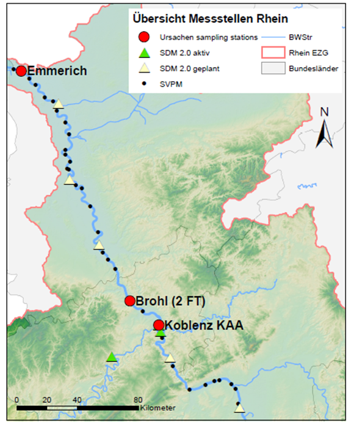
*<sub>Sampling points along the Rhine River for the URSACHEN project. (Source: S. Terweh 2022). </sub>*

# SHORT-TERM TEMPORAL VARIABILITY OF SUSPENDED SEDIMENT CHARACTERISTICS AND CHEMISTRY IN THE RHINE RIVER

>	***Background***: Suspended sediment transport is a natural process, essential
> for assembling ecosystems and transport nutrients through the water body. This 
> process involve the sediment source, transported matter and external controlling 
> factors involved in the variations of the characteristics, as grain size, organic 
> fraction and concentration of suspended sediments. Furthermore, this interaction
> happening during the entrainment of sediments, is affected by temporal (lon and short term)
> and spatial variations. 
> 
>	***Goals***: Using functions, classes, and objects to perform the data 
> analysis of the information obtained during the sampling campaigns. Hence, 
> using python for realizing the statistical analysis, simple and multiple linear 
> regression and the Principal Components Analysis (PCA)

>   ***Requirements***: *Python* libraries: *logging*, *math*, 
> *matplotlib*, *plotly*, *numpy*, *pandas* and *scikit-learn*. 

Please clone the code here:

```
git clone https://github.com/VivianaEloisa/short_temp_variations_Rhine.git
```
# Summary
***
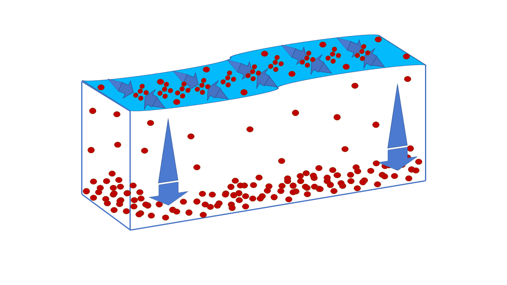 
*<sub>Suspended sediment transport dynamics. </sub>*

Suspended sediment transport is a natural process that involves the movement of
suspended matter through the river and is essential for the distribution of 
nutrients along the water body. This entrainment of 
sediments involves the interaction of different stakeholders, such as, weather
conditions and water cycle, sediment provenance, particle size and distribution, 
geochemical and biochemical composition of sediments, alterations to the natural 
landscape and the influence of the human activities. Additionally, the interaction
of the controlling factors occurs at spatial or temporal basis.


This master thesis is part from the URSACHEN project, conduced by the
German Federal Institute of Hydrology (BfG) and the Centre for Water Resources
and Global Change (ICWRGC), and study the interactions and influences of the physical properties
of the water (Conductivity, pH, Dissolved oxygen and Redox potential), 
chemicals dissolved fraction (Na, Mg, Al, Si2, P, S, K, Mn, Fe and Pb) and 
hydraulic properties (velocity and discharge) in the suspended sediment characterisitcs, 
as grain size, organic fraction and particle size in the Rhine River, at 
three locations: Koblenz, Brohl and Emmerich, at low, middle and high discharge, 
on a short-term (10 minutes) temporal variation.

In this sense, using the data analysis through statistical approach (standard 
deviation and interquartile value) and simple linear regression, is possible to identify that the physical 
properties and hydraulic properties are slightly involved in the variations
of suspended sediment characteristics on a short-term during the sampling campaign, meanwhile, the chemical dissolved
fraction varies with a major frequency and these alterations are highly correlated 
with the suspended sediment concentration. 

Consequently, considering the changes in the sampling campaigns, the suspended sediment concentration increases
as the discharge and velocity increase, this behavior is opposite to the grain size. 
Regarding the dissolved chemical fraction, their interaction with the suspended 
sediment concentration is similar in all the sampling campaigns at middle and high discharge, 
separated from the low discharge. Therefore, elements as: Al, Si2, Mn, Fe and P have a mineral
origin, meanwhile, Na, Mg, S and K have an organic basis, moreover, Pb on a short-term 
temporal study present a neutral correlation.

Moving forward with the data analysis, for a better understanding of the interactions  
between the chemical elements and the suspended sediment concentration, a multiple 
linear regression and a Principal Component Analysis (PCA) are performed. Hence,
this study can give some hints for a possible association with the suspended 
sediments found in the Rhine River with a geochemical origin, related to clay 
material (sediment provenance and particle size), with an intermediate influence 
of human activities and weakly affected by weather conditions on a short-term basis.


# Code
***

### Importing the data to Python

The dataframes were uploaded to python in a csv file format, through python 
classes. In this matter the scripts:`env_reader.py`, `statistics_reader`
and `chemicals_reader` are composed for classes that read a `csv` file and
make it reusable. 

Since all the classes in this project works under the same structure, 
their structure is explained the class `ChemicalsReader`.

*The method `__init__` will have as arguments:
`csv_file_name`: **csv** with the chemical elements data and
`delimiter`: as the separator of the columns in the file*

````Python
    def __init__(self, csv_file_name="chemicals_python.csv", delimiter=","):
        """
        param csv_file_name: csv file with the chemicals data.
        param delimiter: separator in the csv file.
        """
        self.sep = delimiter
        self.chemical_data = csv_file_name
        self.read_data(csv_file_name)
````
*The method `read_data` will have as arguments:
`csv_file_name`: **csv** with the chemical elements data*

```Python
    def read_data(self, csv_file_name):
        """
        Reading the csv file and creating a pandas dataframe.
        param: csv_file_name:csv file with the chemicals data.
        """

        self.chemical_data = pd.read_csv(csv_file_name,
                                         header=0,
                                         sep=self.sep,
                                         usecols=[0, 1, 2, 3, 4, 5, 6, 7, 8,
                                                  9, 10, 11, 12, 13, 14, 15],
                                         names=["Date",
                                                "Na - mg/l",
                                                "Mg - mg/l",
                                                "Al - mg/l",
                                                "Si2 - mg/l",
                                                "P - mg/l",
                                                "S - mg/l",
                                                "K - mg/l",
                                                "Mn - mg/l",
                                                "Fe - mg/l",
                                                "Pb - mg/l",
                                                "SSC(15s) - mg/l",
                                                "Campaign",
                                                "Q - m3/s",
                                                "V - m/s",
                                                "Grain Size"])
```

*The method `__call__()` is used to make the object callable (as a function), 
    so if we have an instance x that defines `__call__(self, csv_file_name)` 
    we can do `x(csv_file_name)`, which is actually a shortcut to 
    `x.__call__ (csv_file_name)`.*

``` Python
    def __call__(self, csv_file_name, *args, **kwargs):
        print()
```

### Exploratory Data Analysis

For observing the distribution of the data, it was realized histogram's, 
using the inbuilt function `plt.subplots` from *matplotlib* and localizing each parameter in
the figure through an `axis` distribution. 

```Python
figure_env, axis = plt.subplots(4, 2)

axis[0, 0].hist(df_env["Conductivity"])
axis[0, 0].set_title("Conductivity")

axis[0, 1].hist(df_env["ODO - mg/l"])
axis[0, 1].set_title("Dissolved Oxygen (mg/l)")

axis[1, 0].hist(df_env["Turbidity - FNU"])
axis[1, 0].set_title("Turbidity - FNU")

axis[1, 1].hist(df_env["pH"])
axis[1, 1].set_title("pH")

axis[2, 0].hist(df_env["SSC (1s) - mg/l"])
axis[2, 0].set_title("SSC (1s) - mg/l")

axis[2, 1].hist(df_env["Q - m3/s"])
axis[2, 1].set_title("Q - m3/s")

axis[3, 0].hist(df_env["V - m/s"])
axis[3, 0].set_title("V - m/s")

axis[3, 1].hist(df_env["ORP mV"])
axis[3, 1].set_title("ORP mV")

# plt.savefig(plots_path  + '/env_hist', bbox_inches='tight')
plt.show()
```
*<sub>Example of the code using the chemical data.</sub>*

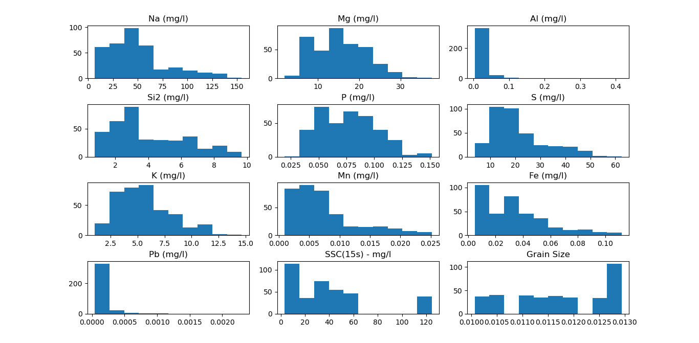 
*<sub> Distribution of the chemical data. </sub>*

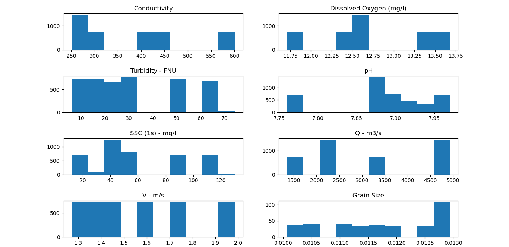 
*<sub> Distribution of the sensor data. </sub>*

Since the distribution is not homogeneous, using the *numpy* inbuilt function
`np.log10` the data was log-transformed.

```Python
df_chem1 = df_chem.drop(columns=["Campaign", "Date"])
log_df_chem = pd.DataFrame(np.log10(df_chem1), columns=df_chem1.columns)
log_df_chem = pd.concat([log_df_chem, df_chem["Campaign"], df_chem["Date"]],
                        axis=1)
```
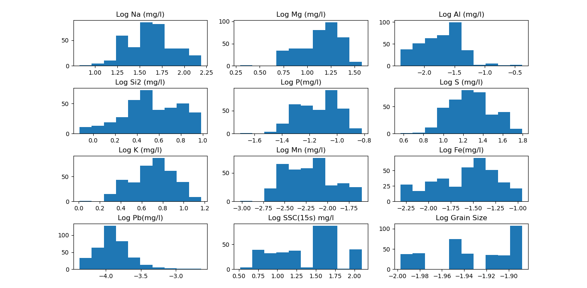 
*<sub> Distribution of the chemical data log-transformed. </sub>*

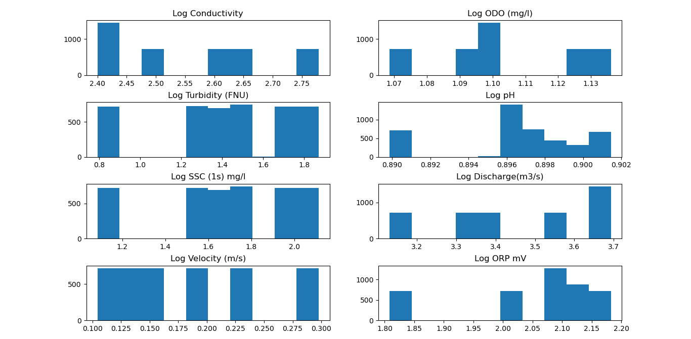 
*<sub> Distribution of the sensor data log-transformed. </sub>*


### Statistical Analysis

Using the data from the class `StatisticsReader` the standard deviation of the 
physical properties of the water, the hydraulic conditions and chemical elements
are plot with the standard deviation of the suspended sediment concentration, using 
a `for` loop.

Thus, for labeling and separating the sampling campaigns, the lists `campaign_1` and 
`campaign_2` have the abbreviation for the sensor data and the sampling data. Also,
for the color coding, it was created two dictionaries:
`color_1` and `color_2`.

```Python
campaign_1 = ["KAA-HW1", "KAA-MW", "BR-HW", "BR-MW", "EM-HW", "EM-MW"]

color_1 = {"KAA-HW1": "firebrick",
           "KAA-MW": "orangered",
           "BR-HW": "green",
           "BR-MW": "yellowgreen",
           "EM-HW": "blue",
           "EM-MW": "steelblue"}

campaign_2 = ["KAA-HW1", "KAA-HW2", "KAA-MW", "KAA-LW", "BR-HW", "BR-MW",
              "BR-LW", "EM-HW", "EM-MW", "EM-LW"]

color_2 = {"KAA-HW1": "firebrick",
           "KAA-HW2": "red",
           "KAA-MW": "orangered",
           "KAA-LW": "lightcoral",
           "BR-HW": "green",
           "BR-MW": "yellowgreen",
           "BR-LW": "springgreen",
           "EM-HW": "blue",
           "EM-MW": "steelblue",
           "EM-LW": "aqua"}
```

For then, plotting in one figure using the in-build function
`plt.subplots` from *matplotlib*, and located on a plane using the `axis`
distribution, followed by `.scatter` that is the type of plot. Inside the `for`
loop, the campaigns are separated using the lists `camapaign_1` and 
`campaign_2` and the function `df.loc` for filtering the data frame.

```Python
fig, axis = plt.subplots(3, 3)

for i in campaign_1:
    filtered_df = df.loc[(df["Campaign"] == i)]
    axis[0, 0].scatter(filtered_df["SSC(1s)-mg/l SD"],
                       filtered_df["Turbidity-FNU SD"],
                       c=filtered_df["Campaign"].map(color_1))
    axis[0, 0].set_xlabel("SSC(1s) - mg/l")
    axis[0, 0].set_ylabel("Turbidity - FNU")
    axis[0, 0].set_title("Turbidity (FNU) SD")

for i in campaign_1:
    filtered_df = df.loc[(df["Campaign"] == i)]
    axis[0, 1].scatter(filtered_df["SSC(1s)-mg/l SD"],
                       filtered_df["ODO-mg/l SD"],
                       c=filtered_df["Campaign"].map(color_1))
    axis[0, 1].set_xlabel("SSC(1s) - mg/l SD")
    axis[0, 1].set_ylabel("ODO - mg/l SD")
    axis[0, 1].set_title("ODO (mg/l) SD")

for i in campaign_1:
    filtered_df = df.loc[(df["Campaign"] == i)]
    axis[0, 2].scatter(filtered_df["SSC(1s)-mg/l SD"],
                       filtered_df["ORP-mV SD"],
                       c=filtered_df["Campaign"].map(color_1))
    axis[0, 2].set_xlabel("SSC(1s) - mg/l SD")
    axis[0, 2].set_ylabel("ORP-mV SD")
    axis[0, 2].set_title("ORP mV SD")

for i in campaign_1:
    filtered_df = df.loc[(df["Campaign"] == i)]
    axis[1, 0].scatter(filtered_df["SSC(1s)-mg/l SD"],
                       filtered_df["Conductivity SD"],
                       c=filtered_df["Campaign"].map(color_1))
    axis[1, 0].set_xlabel("SSC(1s) - mg/l SD")
    axis[1, 0].set_ylabel("Conductivity - mS/cm SD")
    axis[1, 0].set_title("Conductivity SD")

for i in campaign_1:
    filtered_df = df.loc[(df["Campaign"] == i)]
    axis[1, 1].scatter(filtered_df["SSC(1s)-mg/l SD"],
                       filtered_df["pH SD"],
                       c=filtered_df["Campaign"].map(color_1))
    axis[1, 1].set_xlabel("SSC(1s) - mg/l SD")
    axis[1, 1].set_ylabel("pH SD")
    axis[1, 1].set_title("pH SD")

for i in campaign_1:
    filtered_df = df.loc[(df["Campaign"] == i)]
    axis[1, 2].scatter(filtered_df["SSC(1s)-mg/l SD"],
                       filtered_df["Grain size"],
                       c=filtered_df["Campaign"].map(color_1))
    axis[1, 2].set_xlabel("SSC(1s) - mg/l SD")
    axis[1, 2].set_ylabel("Grain size SD")
    axis[1, 2].set_title("Grain Size SD")

for i in campaign_1:
    filtered_df = df.loc[(df["Campaign"] == i)]
    axis[2, 0].scatter(filtered_df["SSC(1s)-mg/l SD"],
                       filtered_df["Q - m3/s"],
                       c=filtered_df["Campaign"].map(color_1))
    axis[2, 0].set_xlabel("SSC(1s) - mg/l SD")
    axis[2, 0].set_ylabel("Q - m3/s SD")
    axis[2, 0].set_title("Discharge (m3/s) SD")

for i in campaign_1:
    filtered_df = df.loc[(df["Campaign"] == i)]
    axis[2, 1].scatter(filtered_df["SSC(1s)-mg/l SD"],
                       filtered_df["V - m/s"],
                       c=filtered_df["Campaign"].map(color_1))
    axis[2, 1].set_xlabel("SSC(1s) - mg/l SD")
    axis[2, 1].set_ylabel("V - m/s SD")
    axis[2, 1].set_title("Velocity (m/s) SD")

fig.legend(campaign_1, loc="center right")
plt.show()
```
*<sub>Example of the code using the sensor data.</sub>*

### Correlation

Using the Person's r principle both data sets are correlated with the  inbuilt function 
`corr()` from *pandas* library and plot with `np.arange`function from *numpy*.

With `.drop()` are removed the non-numerical columns and `plt.subplot` together 
with `.add_subplot()` graph all the correlations in the same figure. Also, `.matshow()`
set the color code and `.colorbar()` displays the color explanation next to the 
graph. 

```Python
filtered_df1 = df_chem.drop(
        columns=["Date", "Campaign"])
corr = filtered_df1.corr()
fig = plt.figure()
ax = fig.add_subplot(111)
cax = ax.matshow(corr, cmap='coolwarm', vmin=-1, vmax=1)
fig.colorbar(cax)
ticks = np.arange(0, len(filtered_df1.columns), 1)
ax.set_xticks(ticks)
plt.xticks(rotation=90)
ax.set_yticks(ticks)
ax.set_xticklabels(filtered_df1.columns)
ax.set_yticklabels(filtered_df1.columns)
plt.show()
```
*<sub> Example for the correlation with Pearson's r code for the chemical data </sub>*

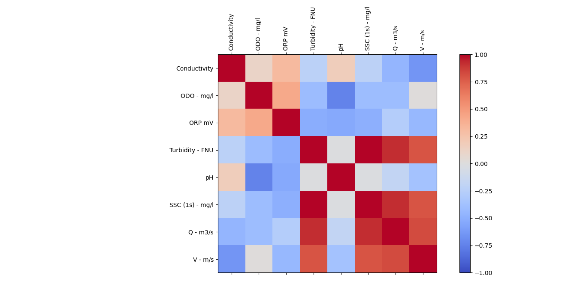 
*<sub> Correlation for the sensor data. </sub>*

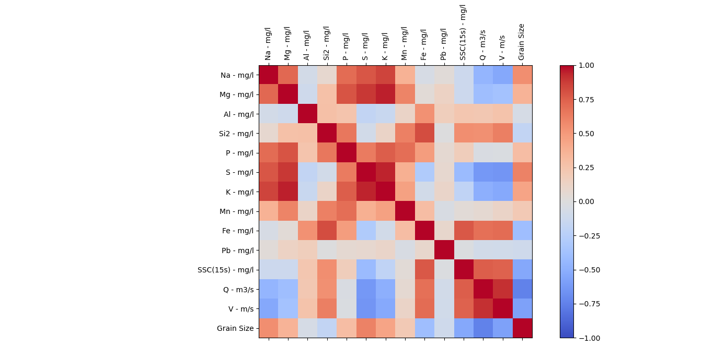 
*<sub> Correlation for the sampled data. </sub>*

### Simple Linear Regression 

The Simple Linear Regression is performed in the two data sets, sensor and 
sampled data in the scripts `lr_enviromental.py` and `lr_chemicals.py`. 
Since the structure of the code is the same for both of the data sets, in 
the next steps the algorithm is explained for the sensor data.

* *The dependent variable "X" corresponds to suspended sediment concentrations, using the 
`drop.na()` function for separating the rest of the columns of the data frame.*

* *The independent variables are expressed by "y" and corresponds to the physical 
properties of the water (Conductivity, pH, Dissolved oxygen and redox potential)
and hydraulic properties (discharge and velocity). Identified as the independent variables 
using the function `.values`.*


```Python
X = df.drop(columns=["Conductivity", "ODO - mg/l", "ORP mV", "Turbidity - FNU", "pH",
                     "V - m/s", "Campaign", "Q - m3/s", "Date"],
            axis=1).values

y1 = df["Conductivity"].values
y2 = df["ODO - mg/l"].values
y3 = df["Turbidity - FNU"].values
y4 = df["pH"].values
y5 = df["ORP mV"].values
y6 = df["Q - m3/s"].values
y7 = df["V - m/s"].values
```

* *The Simple Linear Regression is done with the  class `LinearRegression()` from 
`Scikit-learn`. The method `.fit()` execute the Simple Linear Regression in the
selected variables, `.score()` calculates the coefficient of determination (R2), 
`.coef_` is the coefficient and `.intercept_` is the interception. From the library numpy, 
the functions `stats.pearsonr` calculate the Person's r and `np.std` the standard deviation*

```Python
"""
Linear Regression with discharge.
"""
lr = LinearRegression()

model_y1 = lr.fit(X, y1)
r2_y1 = model_y1.score(X, y1)
a_y1 = model_y1.coef_
b_y1 = model_y1.intercept_
r_y1, p_y1 = stats.pearsonr(df["SSC (1s) - mg/l"], df["Conductivity"])
sd_y1 = np.std(df["Conductivity"])

model_y2 = lr.fit(X, y2)
r2_y2 = model_y2.score(X, y2)
a_y2 = model_y2.coef_
b_y2 = model_y2.intercept_
r_y2, p_y2 = stats.pearsonr(df["SSC (1s) - mg/l"], df["ODO - mg/l"])
sd_y2 = np.std(df["ODO - mg/l"])

model_y3 = lr.fit(X, y3)
r2_y3 = model_y3.score(X, y3)
a_y3 = model_y3.coef_
b_y3 = model_y3.intercept_
r_y3, p_y3 = stats.pearsonr(df["SSC (1s) - mg/l"], df["Turbidity - FNU"])
sd_y3 = np.std(df["Turbidity - FNU"])

model_y4 = lr.fit(X, y4)
r2_y4 = model_y4.score(X, y4)
a_y4 = model_y4.coef_
b_y4 = model_y4.intercept_
r_y4, p_y4 = stats.pearsonr(df["SSC (1s) - mg/l"], df["pH"])
sd_y4 = np.std(df["pH"])

model_y5 = lr.fit(X, y5)
r2_y5 = model_y4.score(X, y5)
a_y5 = model_y5.coef_
b_y5 = model_y5.intercept_
r_y5, p_y5 = stats.pearsonr(df["SSC (1s) - mg/l"], df["ORP mV"])
sd_y5 = np.std(df["ORP mV"])

model_y6 = lr.fit(X, y6)
r2_y6 = model_y6.score(X, y6)
a_y6 = model_y6.coef_
b_y6 = model_y6.intercept_
r_y6, p_y6 = stats.pearsonr(df["SSC (1s) - mg/l"], df["Q - m3/s"])
sd_y6 = np.std(df["Q - m3/s"])

model_y7 = lr.fit(X, y7)
r2_y7 = model_y7.score(X, y7)
a_y7 = model_y7.coef_
b_y7 = model_y7.intercept_
r_y7, p_y7 = stats.pearsonr(df["SSC (1s) - mg/l"], df["V - m/s"])
sd_y7 = np.std(df["V - m/s"])
```

* *Using the pandas function `pd.Dataframe()`, is created a data frame with the coefficients
from the Simple Linear Regression.*

```Python
"""
Creating a dataframe with the outputs of the linear regression.
"""
data1 = {'Parameter': ["Conductivity", "ODO - mg/l", "Turbidity - FNU", "pH",
                      "ORP mV", "Q - m3/s", "V - m/s"]}
df1 = pd.DataFrame(data1)
data2 = {'R2': [r2_y1, r2_y2, r2_y3, r2_y4, r2_y5, r2_y6, r2_y7]}
df2 = pd.DataFrame(data2)
data3 = {'a': [a_y1, a_y2, a_y3, a_y4, a_y5, a_y6, a_y7]}
df3 = pd.DataFrame(data3)
data4 = {'b': [b_y1, b_y2, b_y3, b_y4, b_y5, b_y6, b_y7]}
df4 = pd.DataFrame(data4)
data5 = {'r': [r_y1, r_y2, r_y3, r_y4, r_y5, r_y6, r_y7]}
df5 = pd.DataFrame(data5)
data6 = {'p-value': [p_y1, p_y2, p_y3, p_y4, p_y5, p_y6, p_y7]}
df6 = pd.DataFrame(data6)
data7 = {'SD': [sd_y1, sd_y2, sd_y3, sd_y4, sd_y5, sd_y6, sd_y7]}
df7 = pd.DataFrame(data7)

df_regression_chem = pd.concat([df1, df2, df3, df4, df5, df6, df7], axis=1)
writer = pd.ExcelWriter(df_path + '/df_env_regression.xlsx')
df_regression_chem.to_excel(writer)
writer.save()
print(df_regression_chem)
```
* *For labeling and separating the sampling campaigns, the lists `campaign_1` and 
`campaign_2` have the abbreviation for the sensor data and the sampling data. Also,
for the color coding, it was created two dictionaries:
`color_1` and `color_2`.*

```Python
campaign_1 = ["KAA-HW1", "KAA-MW", "BR-HW", "BR-MW", "EM-HW", "EM-MW"]

color_1 = {"KAA-HW1": "firebrick",
           "KAA-MW": "orangered",
           "BR-HW": "green",
           "BR-MW": "yellowgreen",
           "EM-HW": "blue",
           "EM-MW": "steelblue"}

campaign_2 = ["KAA-HW1", "KAA-HW2", "KAA-MW", "KAA-LW", "BR-HW", "BR-MW",
              "BR-LW", "EM-HW", "EM-MW", "EM-LW"]

color_2 = {"KAA-HW1": "firebrick",
           "KAA-HW2": "red",
           "KAA-MW": "orangered",
           "KAA-LW": "lightcoral",
           "BR-HW": "green",
           "BR-MW": "yellowgreen",
           "BR-LW": "springgreen",
           "EM-HW": "blue",
           "EM-MW": "steelblue",
           "EM-LW": "aqua"}
```

* *Then, plotting in one figure using the in-build function
`plt.subplots` from *matplotlib*, and located on a plane using the `axis`
distribution, followed by `.scatter` that is the type of plot. Inside the `for`
loop, the campaigns are separated using the lists `camapaign_1` and 
`campaign_2` and the function `df.loc` for filtering the data frame.*

```Python
fig, axis = plt.subplots(3, 3)

for i in campaign_1:
    df1 = df.loc[(df["Campaign"] == i)]
    axis[0, 0].scatter(df1["SSC (1s) - mg/l"], df1["Conductivity"],
                       c=df1["Campaign"].map(color))
    axis[0, 0].set_xlabel("Log SSC (1s) - mg/l")
    axis[0, 0].set_ylabel("Log Conductivity")
    axis[0, 0].set_title("Conductivity")
    # plt.legend(campaign_1)
axis[0, 0].plot(X, n1, color="red")
# plt.show()

for i in campaign_1:
    df1 = df.loc[(df["Campaign"] == i)]
    axis[0, 1].scatter(df1["SSC (1s) - mg/l"], df1["ODO - mg/l"],
                       c=df1["Campaign"].map(color))
    axis[0, 1].set_xlabel("Log SSC (1s) - mg/l")
    axis[0, 1].set_ylabel("Log ODO (mg/l)")
    axis[0, 1].set_title("Dissolved Oxygen")
    # plt.legend(campaign_1)
axis[0, 1].plot(X, n2, color="red")
# plt.show()

for i in campaign_1:
    df1 = df.loc[(df["Campaign"] == i)]
    axis[0, 2].scatter(df1["SSC (1s) - mg/l"], df1["Turbidity - FNU"],
                       c=df1["Campaign"].map(color))
    axis[0, 2].set_xlabel("Log SSC (1s) - mg/l")
    axis[0, 2].set_ylabel("Log Turbidity (FNU)")
    axis[0, 2].set_title("Turbidity")
    # plt.legend(campaign_1)
axis[0, 2].plot(X, n3, color="red")
# plt.show()

for i in campaign_1:
    df1 = df.loc[(df["Campaign"] == i)]
    axis[1, 0].scatter(df1["SSC (1s) - mg/l"], df1["pH"],
                       c=df1["Campaign"].map(color))
    axis[1, 0].set_xlabel("Log SSC (1s) - mg/l")
    axis[1, 0].set_ylabel("Log pH")
    axis[1, 0].set_title("pH")
    # plt.legend(campaign_1)
axis[1, 0].plot(X, n4, color="red")
# plt.show()

for i in campaign_1:
    df1 = df.loc[(df["Campaign"] == i)]
    axis[1, 1].scatter(df1["SSC (1s) - mg/l"], df1["ORP mV"],
                       c=df1["Campaign"].map(color))
    axis[1, 1].set_xlabel("Log SSC (1s) - mg/l")
    axis[1, 1].set_ylabel("Log ORP mV")
    axis[1, 1].set_title("ORP")
    # plt.legend(campaign_1)
axis[1, 1].plot(X, n5, color="red")
# plt.show()

for i in campaign_1:
    df1 = df.loc[(df["Campaign"] == i)]
    axis[1, 2].scatter(df1["SSC (1s) - mg/l"], df1["Q - m3/s"],
                       c=df1["Campaign"].map(color))
    axis[1, 2].set_xlabel("Log SSC (1s) - mg/l")
    axis[1, 2].set_ylabel("Log Discharge (m3/s)")
    axis[1, 2].set_title("Discharge")
    # plt.legend(campaign_1)
axis[1, 2].plot(X, n6, color="red")
# plt.show()


for i in campaign_1:
    df1 = df.loc[(df["Campaign"] == i)]
    axis[2, 0].scatter(df1["SSC (1s) - mg/l"], df1["V - m/s"],
                       c=df1["Campaign"].map(color))
    axis[2, 0].set_xlabel("Log SSC (1s) - mg/l")
    axis[2, 0].set_ylabel("Log Velocity - m/s")
    axis[2, 0].set_title("Velocity")
    # plt.legend(campaign_1)
axis[2, 0].plot(X, n7, color="red")
# plt.show()

fig.legend(campaign_1, loc="center right")
plt.show()
```
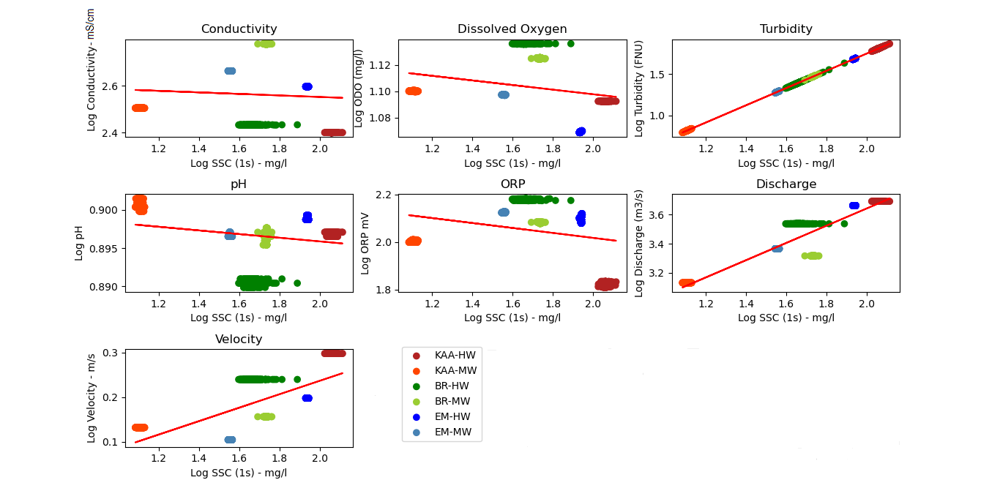 
*<sub> Simple Linear Regression for sensor data. </sub>*

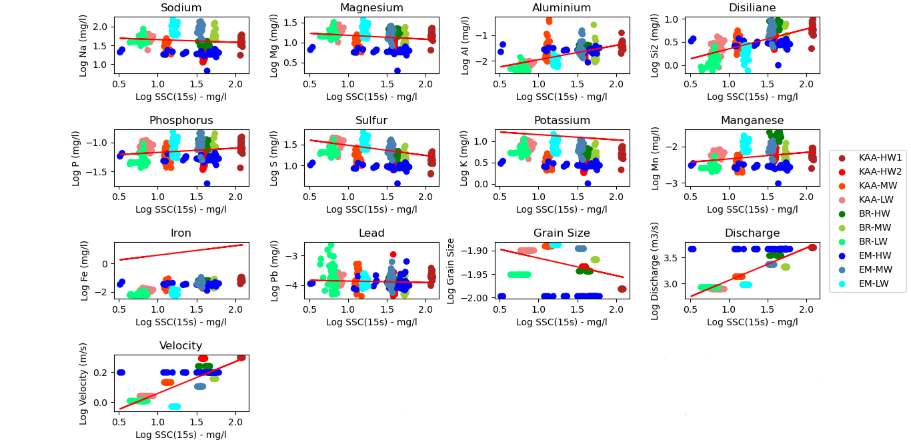 
*<sub> Simple Linear Regression for sampled data. </sub>*

### Principal Components Analysis

* *The Principal Components Analysis is realized on the chemical data, the 
variables for finding the Principal Components are the chemical elements 
and denoted with the "X", using the `.drop()` function for separating the not needed columns.*

* *Meanwhile, the Principal Components are associated to the sampling campaigns, 
expressed as "y" and denoted with the function `.values()`.*

* *The data set is scaled using the class `StandardScaler` from *Scikit-learn**

```Python
X = df.drop(columns=["Date", "Campaign", "Q - m3/s", "V - m/s",
                     "SSC(15s) - mg/l", "Grain Size"],
            axis=1).values
y = df["Campaign"].values
scaler = StandardScaler()
```
* *The function `decomposition.PCA()` define the number of Principal Components 
in which the data set can be explained.*
* *Also the function `.fit_transform()` create the scores and the 
`.components_.T` the loadings. For the scores, as well as, for the loadings are
created data frames using the pandas function `pd.DataFrame()`.*
* *The explained variance is calculated through the function `.explained_variance_ratio_`.*

```Python
pca = decomposition.PCA(n_components=6)

scores = pca.fit_transform(scaler.fit_transform(X))
scores_df = pd.DataFrame(scores, columns=["PC1", "PC2", "PC3", "PC4", "PC5",
                                          "PC6"])
scores_df = pd.concat([scores_df, df["Campaign"], df["Date"]], axis=1)
scores_df = scores_df.dropna()
writer = pd.ExcelWriter(df_path + '/scores_chem_pca.xlsx')
scores_df.to_excel(writer)
writer.save()

loadings = pca.components_.T
df_loadings = pd.DataFrame(loadings, columns=["PC1", "PC2", "PC3", "PC4",
                                              "PC5", "PC6"],
                           index=["Na - mg/l",
                                  "Mg - mg/l",
                                  "Al - mg/l",
                                  "Si2 - mg/l",
                                  "P - mg/l",
                                  "S - mg/l",
                                  "K - mg/l",
                                  "Mn - mg/l",
                                  "Fe - mg/l",
                                  "Pb - mg/l"])

writer = pd.ExcelWriter(df_path + '/loadings_chemicals_pca.xlsx')
df_loadings.to_excel(writer)
writer.save()

explained_variance = pca.explained_variance_ratio_

explained_variance = np.insert(explained_variance, 0, 0)
cumulative_variance = np.cumsum(np.round(explained_variance, decimals=3))
```

* *With the function `px.bar()` the explained variance is plotted and the 
trace of the cumulative variance is with `.add_trace()` both from library Plottly.*
* Then, using the Plottly functions `.scatter_3d` and `.scatter_matrix`, the scores 
and loadings are plotted.*

```Python
fig = px.bar(df_explained_variance, x="PC", y="ExplainedVariance",
             text="ExplainedVariance", width=800)
fig.update_traces(texttemplate="%{text:.3f}", textposition="outside")
fig.show()

fig = go.Figure()
fig.add_trace(
    go.Scatter(x=df_explained_variance["PC"],
               y=df_explained_variance["Cumulative Variance"],
               marker=dict(size=15, color="LightSeaGreen")))
fig.add_trace(
    go.Bar(x=df_explained_variance["PC"],
           y=df_explained_variance["ExplainedVariance"],
           marker=dict(color="RoyalBlue")))
fig.show()

fig = px.scatter_3d(scores_df, x="PC1", y="PC2", z="PC3", color="Campaign")
fig.show()

fig = px.scatter_3d(df_loadings, x="PC1", y="PC2", z="PC3",
                    text=df_loadings.index)
fig.show()

fig = px.scatter_3d(df_loadings, x="PC4", y="PC5", z="PC6",
                    text=df_loadings.index)
fig.show()

labels = {
    str(i): f"PC {i+1} ({var:.1f}%)"
    for i, var in enumerate(explained_variance*100)
}


fig = px.scatter_matrix(
    scores,
    labels=labels,
    dimensions=range(6),
    color=df["Campaign"]
)
fig.update_traces(diagonal_visible=False)
fig.show()
```
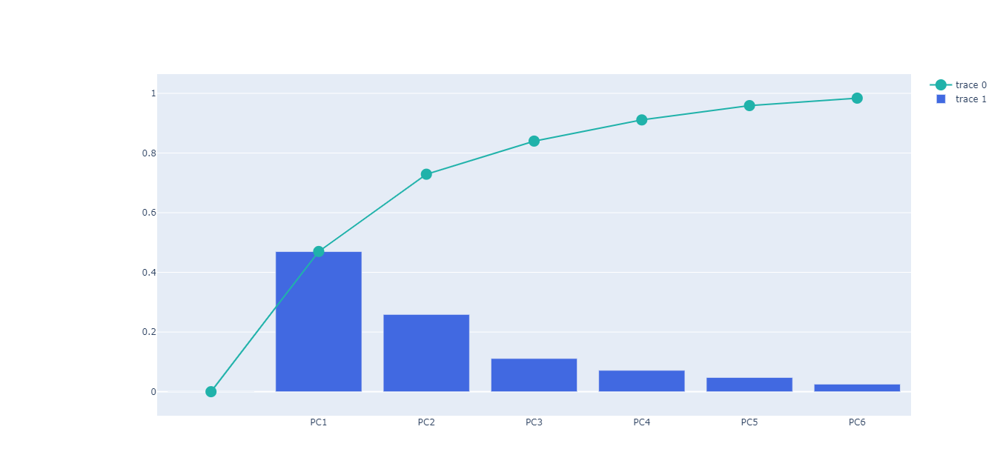 
*<sub> Cumulative variance. </sub>*

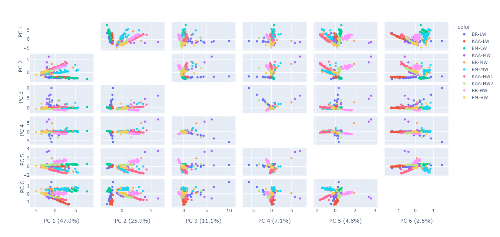 
*<sub> Sampling campaigns correlated to the Principal Components. </sub>*

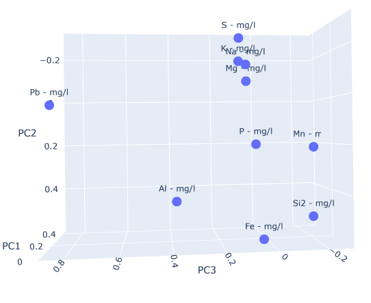 
*<sub> Principal Components 1, 2, and 3 located on a 3D plane.*

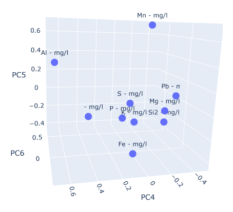 
*<sub> Principal Components 4, 5, and 6 located on a 3D plane.*

### Multiple Linear Regression

The Multiple Linear Regression is based on the 6 Principal Components found in the 
Principal Components Analysis, that are introduced as the explanatory variables, 
represented by "X" and the Suspended Sediment Concentration, as the value to be predicted
expressed with "y".

```Python
X = df1.drop(columns=["Campaign", "Date"], axis=1).values

y = df2["SSC(15s) - mg/l"].values

```
* *For performing a Multiple Linear Regression, it has to be used machine learning, 
thus the data set is spread in "Training data" `_test`and "Test data" `_train`*

* *Since in the case of the Multiple Linear Regression, the independent variables 
are more than one, the coefficients, calculated with the function `.coef_` are the same
number as the "X" variables, in this case 5. The intercept is only one value and
is done with the function `.intercept_`*

```Python
X_train, X_test, y_train, y_test = train_test_split(X, y, test_size=0.3,
                                                    random_state=0)
lr = LinearRegression()

lr.fit(X_train, y_train)
ytest = pd.DataFrame(y_test)
writer = pd.ExcelWriter(df_path + '/ssc_test.xlsx')
ytest.to_excel(writer)
writer.save()


(a1, a2, a3, a4, a5, a6) = lr.coef_
b = lr.intercept_
```
* *Using the function `.predict()` and the `X_train` for predict the Suspended
sediment concentration and train the algorithm. Also `r2_score` measures the 
accuracy of the training. The function `plt.scatter` graphs the training of the
prediction.*
* *Meanwhile, the `X_test` on the function `predict()` test the already trained 
algorithm and also the `r2_score` is calculating the accuracy of the test.

```Python
y_pred_train = lr.predict(X_train)
plt.scatter(x=y_train, y=y_pred_train)
plt.legend(["Predicted"], loc="lower right")
r_train = r2_score(y_train, y_pred_train)
y_pred_test = lr.predict(X_test)
r_test = r2_score(y_test, y_pred_test)
```
* *Finally, using the list `campaign_1` and the dictionary `color`, together with 
a `for` loop and the function `plt.scatter` the tested data is graphed.

```Python
campaign_1 = ["KAA-HW1", "KAA-HW2", "KAA-MW", "KAA-LW", "BR-HW", "BR-MW",
              "BR-LW", "EM-HW", "EM-MW", "EM-LW"]

color = {"KAA-HW1": "firebrick",
         "KAA-HW2": "red",
         "KAA-MW": "orangered",
         "KAA-LW": "lightcoral",
         "BR-HW": "green",
         "BR-MW": "yellowgreen",
         "BR-LW": "springgreen",
         "EM-HW": "deepskyblue",
         "EM-MW": "cyan",
         "EM-LW": "skyblue"}

for i in campaign_1:
    df1 = df3.loc[(df3["Campaign"] == i)]
    plt.scatter(df1["test"], df1["pred"],
                c=df1["Campaign"].map(color))
    plt.xlabel(SSC-mg/l (Sampled))
    plt.ylabel(SSC-mg/l (Predicted))
    plt.legend(campaign_1, loc="lower center")
plt.show()
```

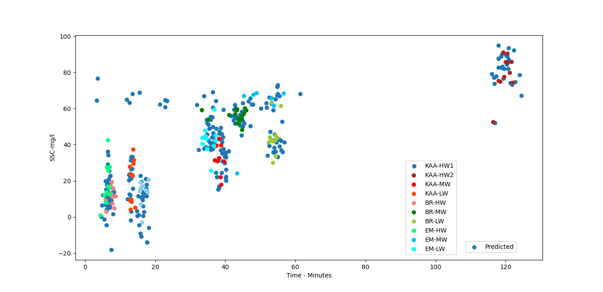 
*<sub> Prediction of the Suspended Sediment Concentration on the sampling campaigns.*
